# Hi, I'm Nguyen Anh Tuan

### Java Backend Developer, still learning to become FullStack Developer

  
  

  
  
  
  

  
  
  

  
  
  
  

---

### Contributions over last year

  <picture>
    <source media="(prefers-color-scheme: dark)" srcset="https://raw.githubusercontent.com/AnhTuan2111/AnhTuan2111/output/github-snake-dark.svg">
    <source media="(prefers-color-scheme: light)" srcset="https://raw.githubusercontent.com/AnhTuan2111/AnhTuan2111/output/github-snake.svg">
    
  </picture>

