


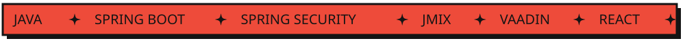

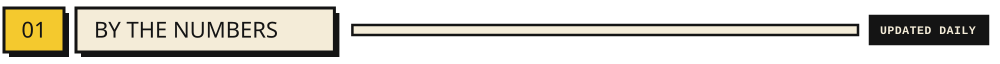
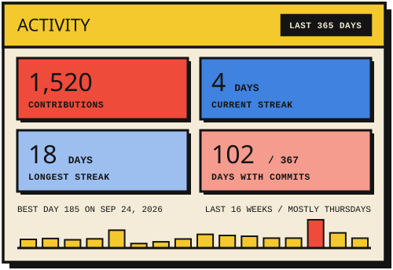
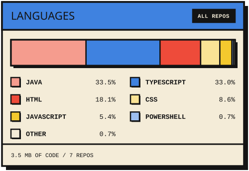

<!-- Each pair below must stay on one line with no space between the tags, or the second card wraps on phones. -->
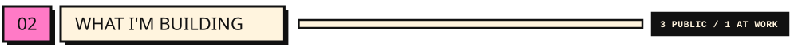
<a href="https://github.com/AnhTuan2111/offline-translate-vi-en">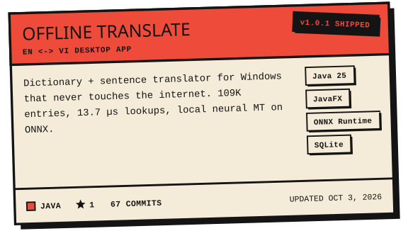</a><a href="https://github.com/AnhTuan2111/RIMS">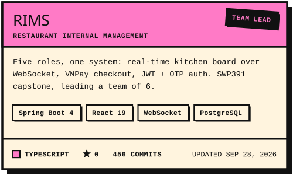</a>
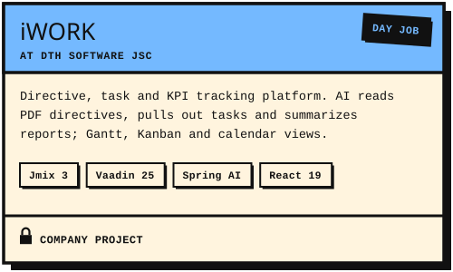<a href="https://github.com/AnhTuan2111/devops-self-learning">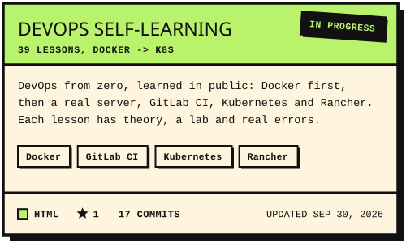</a>

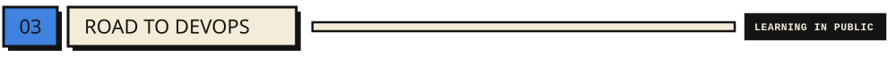
<a href="https://anhtuan2111.github.io/devops-self-learning/">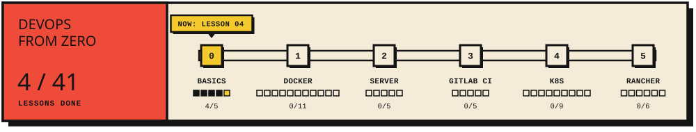</a>

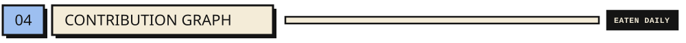
<picture>
  <source media="(prefers-color-scheme: dark)" srcset="https://raw.githubusercontent.com/AnhTuan2111/AnhTuan2111/output/github-snake-dark.svg">
  
</picture>

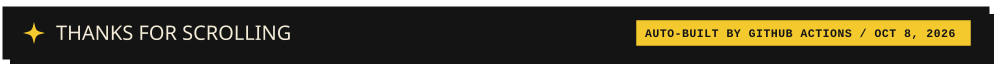

